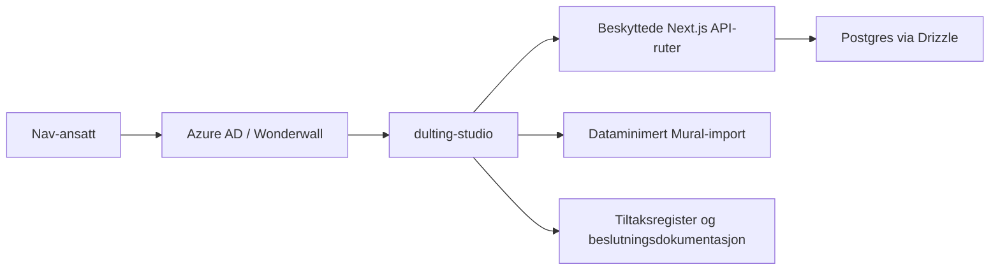

# dulting-studio

[](https://github.com/navikt/dulting-studio/actions/workflows/build-and-deploy.yaml)


## Formålet med repoet

`dulting-studio` er en intern arbeidsflate for Team eSyfo. Appen skal hjelpe
teamet og berørte produkteiere med å importere, sortere og vurdere
dultingtiltak og tiltakspakker med tydelig datagrunnlag, synlige datagrenser og
klar etisk risiko. Første case er oppfølgingsplan.

MVP-en er bevisst avgrenset:

- ingen persondata eller produksjonsdata
- ingen rå Mural-JSON i repo, database eller serverlogger
- ingen produksjonsintegrasjoner eller GitHub API
- ingen admin-UI eller dashboards

## Arkitektur



## Miljøer

- 🚀 [Produksjon](https://dulting-studio.intern.nav.no) — rent prod-verktøy
  (ingen dev). Åpent for alle innloggede Nav-ansatte; kan låses til team-esyfo
  senere. Se [Deploy og database-beslutning](docs/deploy.md).

## Datagrenser

MVP-en skal kun bruke redaksjonelt bearbeidet, ikke-identifiserende innhold.
Repoet og appen skal ikke inneholde:

- personopplysninger
- diagnosegrupper
- konkrete saker
- små eller sårbare segmenter
- produksjonsdata

JSON-strukturen under `data/` inneholder illustrative seed-data for
oppfølgingsplan. Innholdet er på konseptnivå og skal ikke beskrive enkeltsaker,
diagnoser eller konkrete personer.

## Dokumentasjon

- [ADR-001: Egen intern app og eget repo for dulting-studio](docs/adr/ADR-001-dulting-studio.md)
- [ADR-002: Dataminimert Mural-import i MVP](docs/adr/ADR-002-personvern-dataminimering.md)
- [ADR-003: Drizzle ORM og SQL-migrasjoner for MVP](docs/adr/ADR-003-orm-og-migrasjon.md)
- [ADR-004: Konfigurerbare lane-typer og ikke-skårbasert FORGOOD](docs/adr/ADR-004-konfigurerbare-lane-typer.md)
- [PRD: dulting-studio MVP](docs/PRD-dulting-studio-mvp.md)
- [MVP-handoff: status, Mural-first arbeid og neste issues](docs/mvp-handoff.md)
- [Dulting tiltaksregister](docs/dulting-tiltaksregister.md)
- [Dulting tiltaksregister — sykmeldt-sporet](docs/dulting-tiltaksregister-sykmeldt.md)
- [Dulting atferdskartlegging (motivasjon/barriere)](docs/dulting-atferdskartlegging.md)
- [Dulting scoping-status](docs/dulting-scoping-status.md)
- [Sykmeldt-brukerreise — bearbeidet utkast (sparring)](docs/dulting-brukerreise-sykmeldt-utkast.md)
- [Deploy og database-beslutning](docs/deploy.md)
- [Lokal importflyt ende-til-ende](docs/local-import-e2e.md)
- [Manuelle PII-stoppunkter](docs/manuelle-pii-stoppunkter.md)
- [Illustrativt datalag: struktur og grenser](data/README.md)

## Utvikling

Installer avhengigheter med pnpm, og bruk `pnpm run` for å se oppdatert liste
over tilgjengelige skript. Appen kjører lokalt på
[http://localhost:3000](http://localhost:3000).

For å teste beskyttede API-kall lokalt uten Wonderwall/Azure AD kan du slå på
en eksplisitt lokal mock-bruker:

```bash
LOCAL_AUTH_MOCK_ENABLED=true pnpm dev
```

Mocken er kun aktiv utenfor `NODE_ENV=production`, og same-origin-sjekken kjøres
fortsatt før API-et får en bruker. Juster eventuelle grupper med
`LOCAL_AUTH_MOCK_GROUPS=gruppe-1,gruppe-2`.

Se [lokal importflyt ende-til-ende](docs/local-import-e2e.md) for Postgres,
migrasjoner, lokal auth-mock og smoke-test av Mural-import.

### Plattformgrunnmur

- Azure AD og Wonderwall beskytter appen (innlogging kreves). I prod er
  `allowAllUsers: true` — åpent for alle innloggede Nav-ansatte; lås til
  team-esyfo-gruppe senere via `claims.groups` i `nais/nais-prod.yaml`
- `nais/nais-prod.yaml` har eksplisitt tom `accessPolicy` fordi appen foreløpig
  ikke skal ta imot kall fra andre apper eller kalle ut til andre tjenester
- health (`/api/isAlive`), readiness (`/api/isReady`) og metrics
  (`/api/metrics`) er åpne for NAIS-prober og Prometheus
- nye server-endepunkter for data, import og klassifisering skal bruke
  `withProtectedApiRoute()` fra `src/lib/auth.ts` for Azure-tokenvalidering og
  same-origin-sjekk på usikre HTTP-metoder
- endepunkter som krever særskilt tilgang kan i tillegg sette
  `requiredAzureAdGroups` i `withProtectedApiRoute()`. Bruk bare gruppe-IDer som
  ligger i `nais/nais-prod.yaml`, og hold manifest og app-side allowlist
  samkjørt

Repoet bruker database og migrasjoner for importerte prosjekter, widgets og
klassifiseringer. Det skal fortsatt ikke lagre rå Mural-data eller åpne nye
integrasjoner uten ny beslutning.

### Database og migrasjoner

- `src/db/schema.ts` er source of truth for Drizzle-skjemaet.
- `migrations/` skal inneholde reviewbare SQL-migrasjoner som sjekkes inn i git.
- Lokal utvikling bruker `DATABASE_URL` fra `.env` eller tilsvarende lokal
  miljøkonfig. Se `.env.example` for kontrakten.
- Bruk `pnpm run` for å se tilgjengelige scripts. Databaseskriptene er
  `db:generate` og `db:migrate`.
- Følg ADR-003: bruk SQL-migrasjoner i repoet og ikke `drizzle-kit push` som
  mønster i delte miljøer eller produksjon.

### Dataminimert Mural-import

- Parseren i `src/lib/mural-parser.ts` skal bare produsere dataminimert DTO for
  API-et. Rå Mural JSON skal ikke lagres på server, i database eller i repoet.
- `POST /api/projects/import` godtar bare denne DTO-en. Payload med ukjente
  felter, Mural-owner-data, timestamps, URL-er, tokens eller rå HTML avvises med
  `400`.
- MVP-semantikk for reimport er bevisst enkel: samme `sourceId` kan bare
  importeres én gang. Ny import av samme Mural-kilde avvises med `409`, og
  eksisterende klassifiseringer overføres ikke.
- Widget-metadata er strengt begrenset til trygg tabellstruktur
  (`tableRows`/`tableColumns`). `metadata` skal ikke brukes som bakvei for andre
  Mural-felter.
- Reelle Mural-eksporter skal ligge lokalt under `local-mural-exports/`, som er
  ignorert av git. Repoet skal bare ha syntetiske eller saniterte fixtures.
- `widgets_text_content_trgm_idx` er nå definert både i SQL-migrasjon og i
  Drizzle-skjemaet. Det gjør fremtidig `db:generate` mindre tvetydig.
- `pg_trgm` er fortsatt nødvendig for trigram-indeksen. `pgcrypto` er beholdt i
  første migrasjon kun for bakoverkompatibilitet med eldre lokale Postgres-oppsett;
  på Postgres 14+ er `gen_random_uuid()` innebygget og krever ikke extension.

### Illustrativt datalag for case, tiltak og tiltakspakker

JSON-datalaget under `data/cases/<case-id>/` er illustrativt og brukes
til modell, validering og tidlig UI:

- `case.json` beskriver case, problem, hypotesegrunnlag og governance
- `tiltak/*.json` beskriver enkelttiltak med EAST, Fogg og FORGOOD
- `tiltakspakker/*.json` beskriver sammensatte pakker og aggregert FORGOOD

Valideringen ligger i `src/lib/studio-data/` og brukes både i tester og når
forsiden bygger. Ugyldig struktur eller innhold skal derfor stoppe før endringer
blir en del av appen.

### Slik legger Copilot/Hovmester inn illustrative tiltak trygt

1. Legg nye illustrative JSON-filer i riktig mappe under `data/cases/<case-id>/`.
2. Hold deg til etablerte felter og enum-verdier i `src/lib/studio-data/model.ts`.
3. Skriv bare generisk, redaksjonelt bearbeidet innhold på konseptnivå.
4. Ikke legg inn persondata, diagnoser, konkrete saker, saksnære historier,
   små segmenter, e-postadresser eller lange tallsekvenser.
5. Bruk validerings-, type- og testskriptene fra `pnpm run` før commit.
6. Be om vanlig faglig review i pull request før data regnes som godkjent.

## For Nav-ansatte

Interne henvendelser kan sendes via Slack i kanalen
[#esyfo](https://nav-it.slack.com/archives/C012X796B4L).
