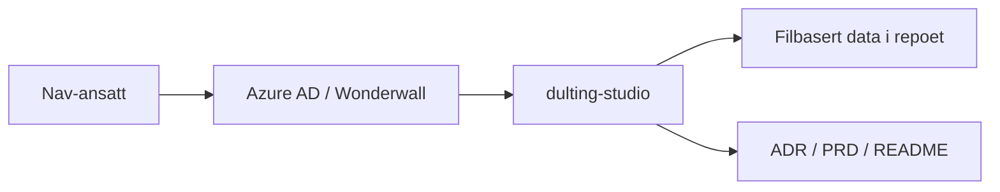

# dulting-studio

## Formålet med repoet

`dulting-studio` er en intern beslutningsapp for Team eSyfo. Appen skal hjelpe
teamet og berørte produkteiere med å utvikle, vurdere og prioritere
dultingtiltak og tiltakspakker med tydelig datagrunnlag, synlige datagrenser og
klar etisk risiko.

Første case er oppfølgingsplan. MVP-en er bevisst avgrenset:

- ingen persondata eller produksjonsdata
- ingen database
- ingen produksjonsintegrasjoner eller GitHub API
- ingen admin-UI eller dashboards

## Arkitektur

## Miljøer

- 🛠️ [Utvikling](https://dulting-studio.intern.dev.nav.no)
- 🚫 Produksjon er ikke satt opp ennå

## Datagrenser

MVP-en skal kun bruke redaksjonelt bearbeidet, ikke-identifiserende innhold.
Repoet og appen skal ikke inneholde:

- personopplysninger
- diagnosegrupper
- konkrete saker
- små eller sårbare segmenter
- produksjonsdata

Filstrukturen under `data/` inneholder nå en validert JSON-modell med
illustrative seed-data for oppfølgingsplan. Innholdet er på konseptnivå og skal
ikke beskrive enkeltsaker, diagnoser eller konkrete personer.

## Dokumentasjon

- [ADR-001: Egen intern app og eget repo for dulting-studio](docs/adr/ADR-001-dulting-studio.md)
- [PRD: dulting-studio MVP](docs/PRD-dulting-studio-mvp.md)
- [Data: struktur og grenser](data/README.md)

## Utvikling

Installer avhengigheter med pnpm, og bruk `pnpm run` for å se oppdatert liste
over tilgjengelige skript. Appen kjører lokalt på
[http://localhost:3000](http://localhost:3000).

### Datalag for case, tiltak og tiltakspakker

Det filbaserte datalaget ligger under `data/cases/<case-id>/`:

- `case.json` beskriver case, problem, hypotesegrunnlag og governance
- `tiltak/*.json` beskriver enkelttiltak med EAST, Fogg og FORGOOD
- `tiltakspakker/*.json` beskriver sammensatte pakker og aggregert FORGOOD

Valideringen ligger i `src/lib/studio-data/` og brukes både i tester og når
forsiden bygger. Ugyldig struktur eller innhold skal derfor stoppe før endringer
blir en del av appen.

### Slik legger Copilot/Hovmester inn nye tiltak trygt

1. Legg nye JSON-filer i riktig mappe under `data/cases/<case-id>/`.
2. Hold deg til etablerte felter og enum-verdier i `src/lib/studio-data/model.ts`.
3. Skriv bare generisk, redaksjonelt bearbeidet innhold på konseptnivå.
4. Ikke legg inn persondata, diagnoser, konkrete saker, saksnære historier,
   små segmenter, e-postadresser eller lange tallsekvenser.
5. Kjør `pnpm validate:data`, `pnpm check` og `pnpm test` før commit.
6. Be om vanlig faglig review i pull request før data regnes som godkjent.

## For Nav-ansatte

Interne henvendelser kan sendes via Slack i kanalen
[#esyfo](https://nav-it.slack.com/archives/C012X796B4L).
