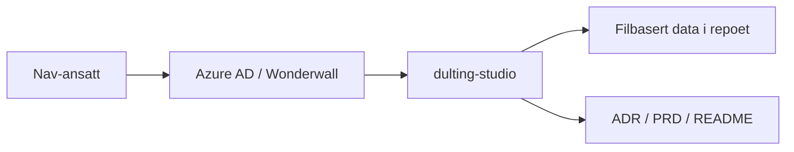

# dulting-studio

## Formålet med repoet

`dulting-studio` er en intern beslutningsapp for Team eSyfo. Appen skal hjelpe
teamet og berørte produkteiere med å utvikle, vurdere og prioritere
dultingtiltak og tiltakspakker med tydelig datagrunnlag, synlige datagrenser og
klar etisk risiko.

Første case er oppfølgingsplan. MVP-en er bevisst avgrenset:

- ingen persondata eller produksjonsdata
- ingen database
- ingen produksjonsintegrasjoner eller GitHub API
- ingen admin-UI eller dashboards

## Arkitektur

## Miljøer

- 🛠️ [Utvikling](https://dulting-studio.intern.dev.nav.no)
- 🚫 Produksjon er ikke satt opp ennå

## Datagrenser

MVP-en skal kun bruke redaksjonelt bearbeidet, ikke-identifiserende innhold.
Repoet og appen skal ikke inneholde:

- personopplysninger
- diagnosegrupper
- konkrete saker
- små eller sårbare segmenter
- produksjonsdata

Filstrukturen under `data/` er opprettet for fremtidig YAML/JSON-basert innhold,
men denne første leveransen inneholder ikke seed-data.

## Dokumentasjon

- [ADR-001: Egen intern app og eget repo for dulting-studio](docs/adr/ADR-001-dulting-studio.md)
- [PRD: dulting-studio MVP](docs/PRD-dulting-studio-mvp.md)

## Utvikling

Installer avhengigheter med pnpm, og bruk `pnpm run` for å se oppdatert liste
over tilgjengelige skript. Appen kjører lokalt på
[http://localhost:3000](http://localhost:3000).

## For Nav-ansatte

Interne henvendelser kan sendes via Slack i kanalen
[#esyfo](https://nav-it.slack.com/archives/C012X796B4L).
